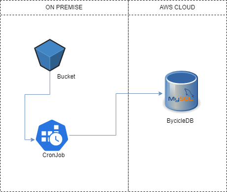

# Desafio de Ingestão de Dados

## Arquitetura do Projeto



O projeto de ingestão é formado pelos seguintes elementos:

1. ### Bucket

Bucket foi simulado como uma pasta no ambiente On Premise, no qual, continha os arquivos .CSV a serem ingeridos

O Bucket possuia a seguinte estrutura:


* Pasta ToDo contendo os arquivo a serem processados
* Pasta Doing contendo os arquivos que estão sendo processado
* Pasa Done contendo os arquivos que já foram processado


2. ### CronJob

O CronJob é uma aplicação Python responsável por ler os arquivos do Bucket e inserir as informações no Banco de dados.

No ambiente On Premise é possível programar o CronJob para rodar periodicamente, afim de definir uma rotina de ingestão.

3. ### BycicleDB

O BycicleDB é um banco de dados MySQL instanciado na AWS. O mesmo possui a seguinte modelagem:


# Como roda o projeto ?

Antes de executar o projeto é necessário prepara o ambiente

## Step 1 - Criação do Bucket

Crie uma pasta em seu computador com o nome **bucket**, dentro dessa pasta crie as seguintes pastas: **ToDo**, **Doing**, **Done**.

Os arquivos a serem ingeridos estão na pasta /documentos/dados desse projeto

## Step 2 - Instalação das Dependências 

Considerando que o projeto já foi clonado na máquina, execute o seguinte comando para a instalação das dependências:

```
pip install -r requirements.txt

```

## Step 3 - Configurações da aplicação

Devido a sensibilidade das informações esse repositório não possui o arquivo **appSettings.json**, dessa forma será necessário criá-lo e adicioná-lo ao projeto. O arquivo possui a seguinte estrutura.

```
    {
    "host": "server_do_banco",
    "port": "porta_do_serve",
    "database": "nome_do_banco",
    "user": "usuario",
    "password": "senha",
    "bucketPath": "caminho_base_bucket"
    }

```
Após o preenchimento do arquivo ele deve ser colocado na raiz da pasta src/ do projeto, como mostra a imagem:


## Step 4 - Executando o Projeto

O projeto pode ser executado de duas formas, a primeira como uma aplicação de python comum e a segunda como um cronjob.

### 1ª Forma

Ir até a pasta raiz do projeto e executar o seguinte comando:


```
python3 app.py

```

### 2ª Forma

Esta configuração pode variar do Sistema Operacional utilizado, o exemplo dado é para um Ubuntu 22.04 LTS.

Para criar o Cron Job primeiramente execute o seguinte comando:

```
sudo crontab -e

```

Feito isso irá ver um documento, edite-o com o período Cron e o comando que o mesmo deve executar, conforme imagem abaixo:


No caso acima está programa para rodar de 1 em 1 hora, mas pode ser modificado para o período em que achar melhor.

# Análise de Dados

1. Escreva uma query que retorna a quantidade de linhas na tabela Sales.SalesOrderDetail pelo campo SalesOrderID, desde que tenham pelo menos três linhas de detalhes.

```
SELECT 
	SalesOrderID as id, 
	COUNT(*) AS qtd 
FROM `sales.salesOrderDetail` as sod
GROUP BY SalesOrderID
HAVING qtd >= 3;

```

2. Escreva uma query que ligue as tabelas Sales.SalesOrderDetail, Sales.SpecialOfferProduct e Production.Product e retorne os 3 produtos (Name) mais vendidos (pela soma de OrderQty), agrupados pelo número de dias para manufatura (DaysToManufacture).

```
SELECT * FROM (
  SELECT p.DaysToManufacture AS dtm,
         ROW_NUMBER() OVER(PARTITION BY p.DaysToManufacture ORDER BY sum(sod.OrderQty) DESC) as pos,
         p.Name as name,
         sum(sod.OrderQty) AS qtd
  FROM `sales.specialOfferProduct` AS sop 
  INNER JOIN `production.product` AS p ON sop.ProductID = p.ProductID
  INNER JOIN `sales.salesOrderDetail` AS sod ON sop.SpecialOfferID = sod.SalesOrderDetailID
  GROUP BY name
  ) as by_pos
WHERE pos <= 3 LIMIT 3;
```

3. Escreva uma query ligando as tabelas Person.Person, Sales.Customer e Sales.SalesOrderHeader de forma a obter uma lista de nomes de clientes e uma contagem de pedidos efetuados.

```
SELECT c.CustomerID as id, 
       p.FirstName as nomeCliente, 
       COUNT(*) AS qtd 
FROM `sales.salesOrderHeader` as soh
INNER JOIN	`sales.customer` as c ON soh.CustomerID = c.CustomerID
INNER JOIN `person.person` as p ON c.PersonID = p.BusinessEntityID 
GROUP BY c.PersonID
ORDER BY qtd DESC;

```

4. Escreva uma query usando as tabelas Sales.SalesOrderHeader, Sales.SalesOrderDetail e Production.Product, de forma a obter a soma total de produtos (OrderQty) por ProductID e OrderDate.

```
SELECT sod.ProductID as id, 
       p.Name as nomeProduto,
       sum(OrderQty) OVER(PARTITION BY sod.ProductID) AS qtd_id,
       soh.OrderDate,  
       sum(OrderQty) OVER(PARTITION BY soh.OrderDate) AS qtd_OrderDate
FROM `sales.salesOrderDetail` AS sod
INNER JOIN `sales.salesOrderHeader` as soh ON sod.SalesOrderID  = soh.SalesOrderID 
INNER JOIN `production.product` AS p ON sod.ProductID = p.ProductID 
GROUP BY sod.ProductID, soh.OrderDate
ORDER BY soh.OrderDate;

```

5. Escreva uma query mostrando os campos SalesOrderID, OrderDate e TotalDue da tabela Sales.SalesOrderHeader. Obtenha apenas as linhas onde a ordem tenha sido feita durante o mês de setembro/2011 e o total devido esteja acima de 1.000. Ordene pelo total devido decrescente.

```
SELECT SalesOrderID, DATE(OrderDate), TotalDue 
FROM `sales.salesOrderHeader` AS soh 
WHERE DATE(OrderDate) BETWEEN DATE('2011-09-01') AND DATE('2011-09-30') AND TotalDue > 1.000
ORDER BY TotalDue DESC;

```


